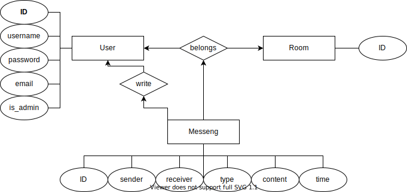

# Chit-Chat

 

<!-- (Itt fentebb majd a 'Chat'-et ki kell cserélni 'Chit-Chatre') -->

## Description
This is a basic chat application for learning purposes **only**! During the development I use NodeJS + AngularJS + MySQL.

---

## Specificaiton
* A user can:
  * regist
  * login
  * read rooms
  * read messages between him and other user
  * send messages to rooms
  * send messages to users

---

## Diagrams

Entity-Relation Diagram

Ide kell még valami

Class Diagram

itt lesz majd egy kép, asszem

